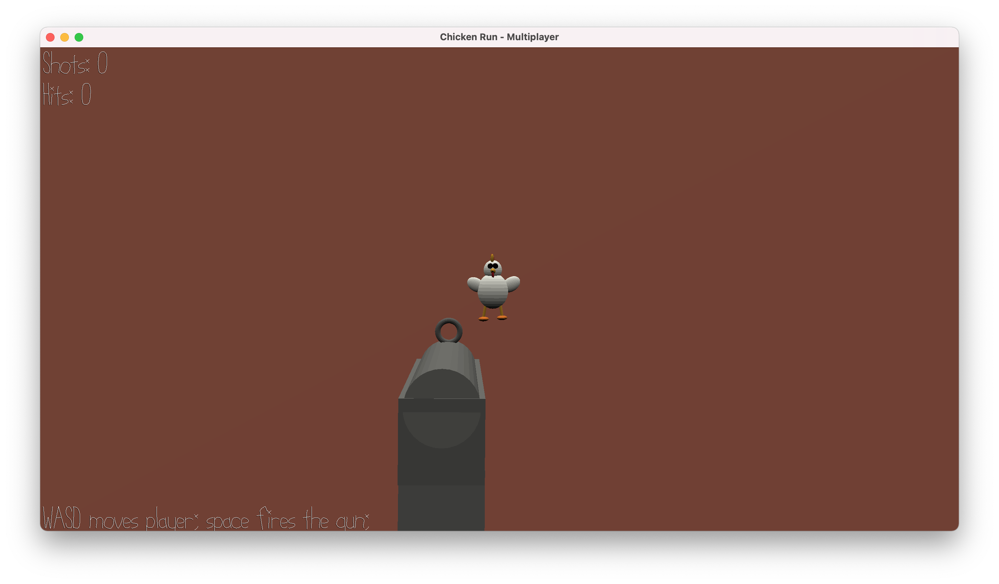

# Chicken Run - Multiplayer

Author: Sacha Bartholme

Design: Inpsired by the 2000 stop-motion animated comedy film "[Chicken Run](https://en.wikipedia.org/wiki/Chicken_Run)", a hunter needs to shoot down a moving chicken.

Networking: The game is based on the starter code. The server maintains a game state. Clients send controls to the server, the server responds with the updated game state and client update the UI based on the new game state. The messages consist of a few marshalled fields like position and a boolean indicating the firing of the gun (see Game.cpp).

Screen Shot:

How To Play:

Start the server. Start the first client (this will be the player controlling the gun). The gun can be moved using WASD and fired using space. Start the second client (this will be the player controlling the chicken). The chicken can be moved using WASD. The gun should hit the chicken and the chicken should escape the gun.

Sources:
- https://jfxr.frozenfractal.com/ (for sound creation)

This game was built with [NEST](NEST.md).

